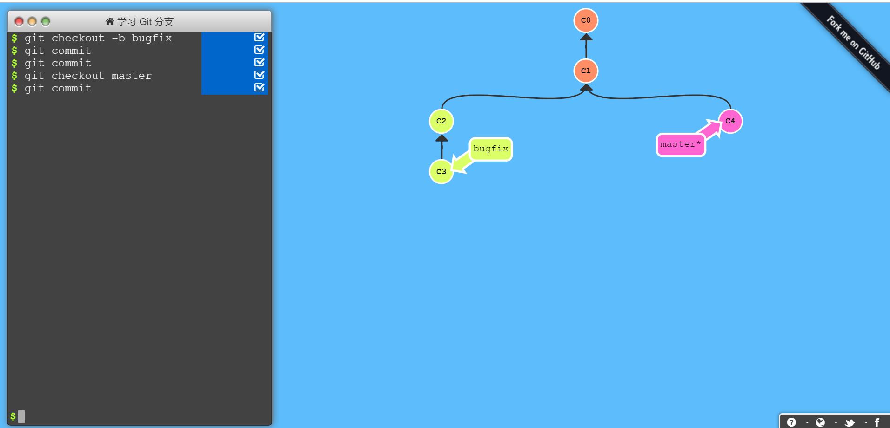
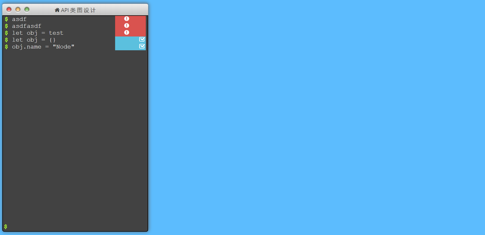
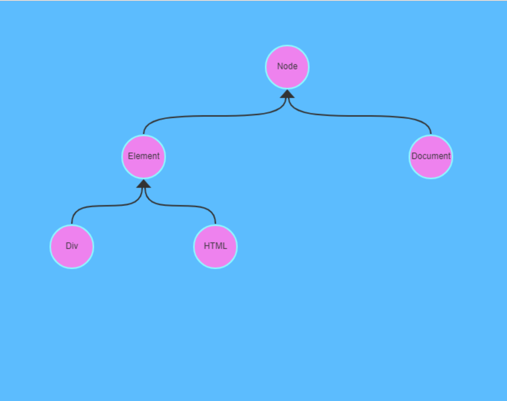
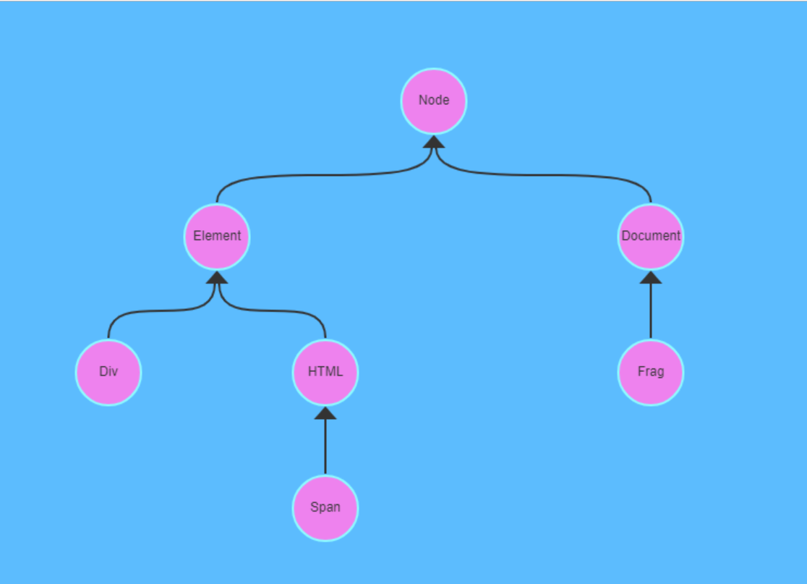
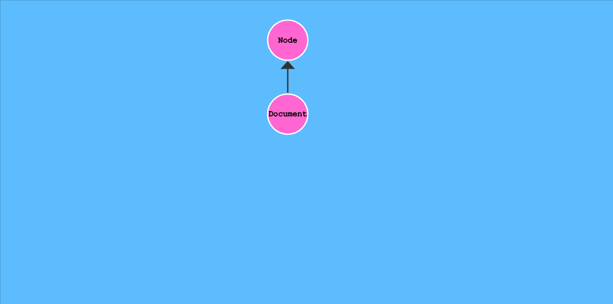

# API Tree项目开发

这个项目是参考[Learn Git Branching](https://learngitbranching.js.org/?NODEMO)项目开发的。很多思路是参考该项目的。

- 用意：做一个用命令控制生成API类图的项目，类图有动态展示的效果。
- 技术：react + redux + canvas + es6
- 题外话：这个项目是我在洗澡时，突然来的灵感，源自于不久前看到[Learn Git Branching](https://learngitbranching.js.org/?NODEMO)项目的演示demo，加上自己最近在背js的API文档，DOM中出现很多继承关系。我想如果可以将API类图的关系，在网页上通过命令，用节点的方式表现出来，会不会很赞。后来我就和两个朋友说了自己的这个想法。花了一番时间，才让他们明白我的想法，他们很支持我这么做。



## 1月

### 22号

- 用时：6小时
- 今日思路：一开始想法很简单，就是参考Learn Git Branching项目实现的，可惜的是，该项目使用react0.13，节点图也是使用svg实现。而我决定采用react16.7+canvas，所以对我而言，只有页面布局可以复用，具体功能还是要自己实现的。
- 工作：完成项目创建api-tree-diagram，并设计开发思路，划分功能模块为control和canvas。control使用命令控制dom中树图形的展示；canvas模块用于动态绘制API节点类图。

### 23号

- 用时：13小时
- 工作：完成控制台页面开发，考虑到后期需要动态调整页面大小，页面整体采用flex布局实现，可以根据屏幕自适应大小，实现动画效果
- 整体布局：分为控制模块和canvas绘图模块

 

### 24号

- 用时：12小时
- 工作：完成控制台功能开发
- 功能：添加命令进入commandList，通过Promise中间件，实现异步命令状态的改变
- 难点：在如何实现命令的状态异步发送，我卡了比较久，具体：用户发送一条命令，我要告诉他命令执行结果：1. 执行中，2. 错误，3. 警告，4. 执行成功。 如何处理异步action之间的状态切换，使用promise中间件完成页面的状态变化。
- 整体布局：控制台命令分为三个大组件，header，commandList，addCommand



### 25号

- 用时：13小时
- 工作：使用canvas画基本的api继承图
- 功能：实现根据ApiNode对象来画静态的API类图，无法计算下层节点的合理位置 ==未实现==。
- 浪费时间：使用canvas画基本的api继承图，图形过于复杂，未能找到如何渲染，整个api类图一开始设想的是使用map存储，标识符与对象的对应关系，然后通过对象之间的extend属性来通过数组生成树的方式，确定树状图形。所以在一开始使用数组生成树的方式，折腾8个小时左右。最后实在无法将整个类图完整绘制出来，最终如下。 **一开始的思路出错，写了很多无用代码，浪费了8小时左右**
- 整体布局：节点按照继承的方式，依次排列在canvas上，但是难以计算下层节点的位置。

 

### 26号

- 用时：13小时

- 工作：使用canvas绘制静态dom树型结构

- 功能：实现根据ApiTree对象的root节点来画静态的API类图。

- 问题：这一天几乎就是在确定用什么 **数据结构去存储dom节点**，还要满足能够**反映操作前后dom树的变化** 。最终采用对象+数组的方式描述dom树

  ```js
  //树上的一个节点，用于记录位置信息
  class ApiNode{
      constructor(name,apiTree,isRoot = false){
          //子节点数组
          this.children = [];
          this.name = name;
          this.isRoot = isRoot;
          //从属的树
          this.apiTree = apiTree;
          //父节点
          this.parentNode = null;
      }
  }
  //维护树的渲染，保证只有一个root节点，类似于DOM中的document对象。
  class ApiTree{
      constructor(){
          //通过apiTree来创建的节点
          this.freeNodes = [];
          this.root = new ApiNode("Root", this, true);
          //通过append挂载的所有节点
          this.mountNodes = [this.root];
      }
  }
  ```

  

- 整体布局：从root节点开始递归的渲染下层节点，每个节点的xy坐标属性，都是根据上次节点的坐标推导出来的。

  

  

### 27号

- 用时：13小时

- 工作：使用canvas动态绘制dom树型结构，将对dom树append操作，动态的反应到canvas 图形上。

- 原理：先计算dom树，修改后的节点位置，分别设置每个节点的targetX和targetY值，这样就可以利用requestAnimationFrame函数，不断的更新每个节点的x，y值，让其不断累加，直至目标值，也就是targetX、targetY，从而产生动画效果。主要操作分为两步：**1.计算apiTree上所有节点，经过修改之后的targetX和targetY值；**  **2. 通过定时函数动态的逼近该值。**

- 问题以及解决策略：

  1. 到达目标后，如何取消requestAnimationFrame函数的调用？

     解决方案：这里我为root节点增加了一个运动次数currentCount的属性，用于判断是否结束动画效果。当currentCount>=totalCount时，取消对requestAnimationFrame的调用。==解决==

  2. 由于DOM树append操作的方法耦合度较高，几乎无法复用任何代码。意味着每次都要为一个新的DOM树操作，定义一个不同的处理函数和一个渲染函数，实现起来很麻烦。==未解决==

     

- 功能：实现根据ApiTree对象的root节点来画动态的API类图。

- 整体布局：**所有节点的位置都依赖root节点的位置生成，几乎无法实现局部渲染**。

### 28号

- 用时：8小时

- 工作：设计dom树渲染函数代码解耦方案。

- 原理：将dom树上所有组件抽象成类，节点类，三角形类，曲线类，以后可能还会有各种提示类，比如

- 问题以及解决策略：

  1. 到达目标后，如何取消requestAnimationFrame函数的调用？

     解决方案：这里我为root节点增加了一个运动次数currentCount的属性，用于判断是否结束动画效果。当currentCount>=totalCount时，取消对requestAnimationFrame的调用。==解决==

  2. 由于DOM树append操作的方法耦合度较高，几乎无法复用任何代码。意味着每次都要为一个新的DOM树操作，定义一个不同的处理函数和一个渲染函数，实现起来很麻烦。==未解决==

     

- 功能：实现根据ApiTree对象的root节点来画动态的API类图。

- 整体布局：**所有节点的位置都依赖root节点的位置生成，几乎无法实现局部渲染**。

### 29号


